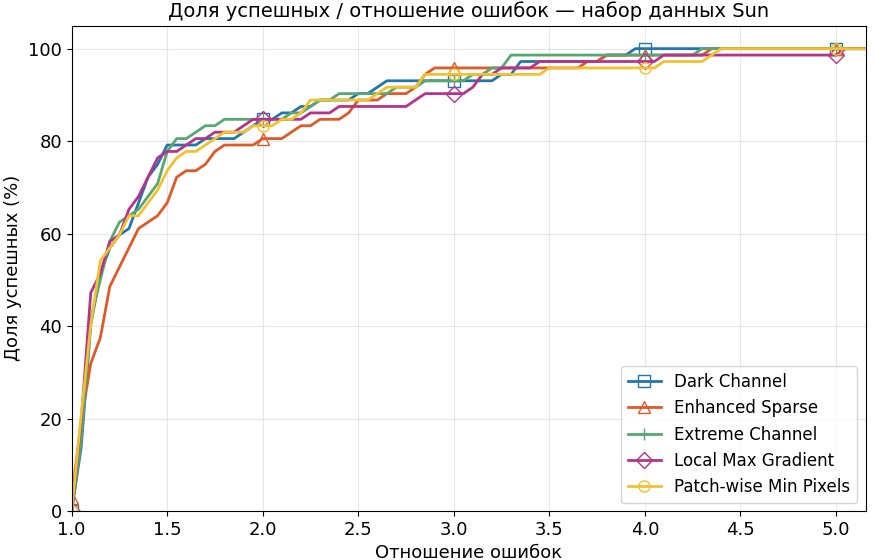
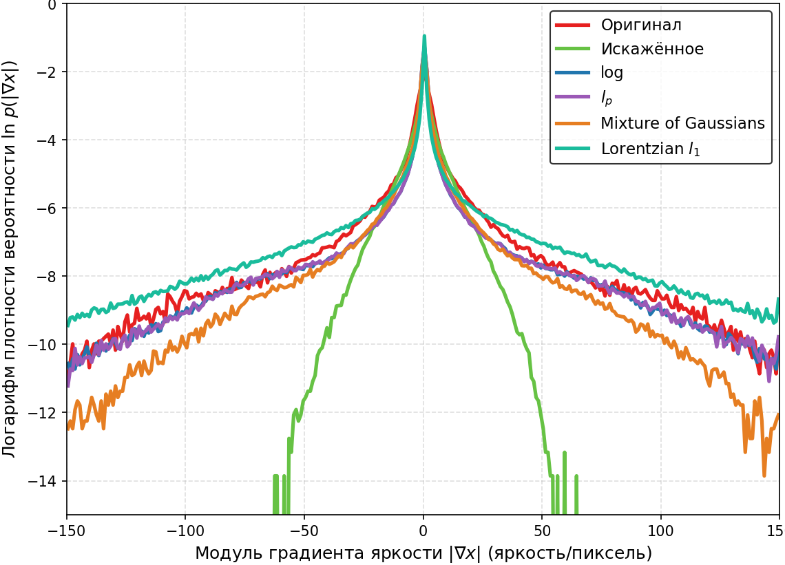

# Research and Development of Blind Image Deconvolution Methods

[](https://github.com/PavelYurov/blind_deconvolution/actions/workflows/ci.yml)

## Описание проекта

Данный проект посвящен исследованию и созданию методов Blind Image Deconvolution - восстановления искаженных изображений вслепую без априорной информации о функции рассеяния точки Point Spread Function с интегрированной системой автоматической оптимизации гиперпараметров. Основное внимание уделяется разработке и сравнению алгоритмов, способных реконструировать исходное изображение в условиях высокой неопределенности относительно характера размытия и аппаратного шума.

##  Полученные результаты

### На бенчмарках

**Levin**
<p align="center">
  
</p>

**Sun**
<p align="center">
  
</p>

**Kohler**
<p align="center">
  
</p>

### На реальных данных без известного заранее эталонного кадра

| Искаженное | Восстановленное | Оцененное ядро |
| :---: | :---: | :---: |
|  |  |  |
|  |  |  |
|  |  |  |
|  |  |  |
|  |  |  |


### Цель исследования

Реализация и многокритериальный анализ предельных возможностей методов восстановления изображений, искаженных различными типами размытия и шумов. В рамках исследования предполагается: систематическая оценка качества восстановления, автоматический подбор оптимальных гиперпараметров, сопоставление разработанных алгоритмов с современными подходами.

### Основные задачи
- **Исследование современных методов Blind Deconvolution, Kernel & Noise Estimation, Super-Resolution**
- **Разработка и имплементация алгоритмов восстановления изображений:** вариационные байесовские, структруные интенсивностные, и разреживающие модели
- **Создание интегрированной системы автоматической оптимизации гиперпараметров и многокритериального анализа (multiobjectivization):** применение байесовской оптимизации - TPE (Tree-structured Parzen Estimator), MCMC-FMP (MCMC - Factorized Mixture Proposal) в сочетании с (t,m,s)-nets (low-discrepancy sequences); построение многомерных Парето‑фронтов для визуализации компромиссов между качеством и устойчивостью к искажениям.
- **Сравнительный анализ современных подходов** — оценка точности восстановления, качества оценки PSF и вычислительной эффективности разработанных методов

## Функциональность фреймворка

### Обработка изображений
- Поддержка монохромных и цветных изображений в форматах JPEG, BMP, PNG (возможность добавления RAW)
- Пакетная обработка групп изображений с единым конвейером
- Настройка экспериментов через конфигурационные файлы (YAML/JSON)

### Генерация реалистичных искажений
- **Виды размытия:**
  - Расфокус (defocus) — 2D аппаратная функция с центральной симметрией
  - Смаз от движения (motion blur) — 1D ядро вдоль заданного направления
  - Комбинированные траектории — смазы по B‑сплайновым кривым
  
  <p align="center">
    
  </p>

- **Виды шумов:**
  - Гауссов шум (белый/цветной)
  - Пуассонов шум
  - Импульсный шум (salt & pepper)
  - Броуновский
  - Розовый
  
  <p align="center">
    
  </p>

- Возможность последовательного наложения нескольких искажений с контролируемой энергией относительно исходного изображения

### Метрики качества
- **PSNR, SSIM** — сравнение восстановленного изображения с оригиналом
- Оценка устойчивости к шумам
- Измерение времени выполнения алгоритмов

### Оптимизации гиперпараметров
- **TPE**: Tree‑Structured Parzen Estimator
- **MCMC-FMP**: MCMC - Factorized Mixture Proposal
- **(t,m,s)-nets**: low-discrepancy sequences   

### Визуализация
- **Многомерные Парето-фронты** (качество, сложность смаза, изолированный вклад шума)

<p align="center">
  
  <br>
  
</p>

- **Success Rate vs. Error Ratio** 

<p align="center">
  
</p>

- **Гистограммы градиентов для разных априорных распределений**

<p align="center">
  
</p>
  

## Методы восстановления
- **Байесовские и вариационные подходы методы**:
  - Робастные модели с тяжёлыми хвостами (Hyperbolic-Secant, Mixture of Gaussians, t-Student)
  - Супергауссовские априорные распределения (Super-Gaussian Priors)
  - Вариационный байесовский вывод (Variational Bayesian Inference)
- **Методы на основе статистики каналов и градиентов**:
  - Использование статистики темного и экстремальных каналов (Dark/Extreme Channels Prior)
  - Априорная модель патчевых минимальных пикселей (PMP) и локальных максимумов градиентов (LMGP)
  - Применение $l_0$, $l_p$ квазинорм
- **Продвинутая регуляризация**:
  - Логарифмические априорные модели на основе Primal-Dual и Majorization-Minimization схем
  - Регуляризация на основе взвешенной графовой полной вариации (Reweighted Graph Total Variation)
  - Адаптивная Эйлер-Эластика (Euler's Elastica) и методы дробного порядка (Fractional-Order)
  - Многоуровневое иерархическое разложение (MHDM); зеркальный спуск (Mirror Descent)
  - Нелокальная низкоранговая тензорная аппроксимация (Low-Rank, t‑SVD, WNNM)
- **Гибридные и модифицированные подходы**:
  - Совместное сверхразрешение и слепая деконволюция (Joint Super‑Resolution & Blind Deconvolution)
  - Интеграция алгоритмов шумоподавления (VST, ScreeNOT, PCA) в итерационные схемы восстановления (Plug‑and‑Play)         

Подробнее об алгоритмах: [Путеводитель по алгоритмам](src/blinddeconv/algorithms/README.md)

## Техническое описание

### 1. Клонирование репозитория и настройка окружения

```bash
git clone https://github.com/PavelYurov/blind_deconvolution.git
cd blind_deconvolution
python -m venv .venv
```
Windows PowerShell
```bash
.venv\Scripts\Activate.ps1
```
Linux / macOS
```bash
source .venv/bin/activate
```

### 2. Установка пакета

Базовая установка (минимальные зависимости)
```bash
pip install -e .
```

С поддержкой CLI-интерфейса (run.py, cli.py)
```bash
pip install -e ".[cli]"
```
Для разработки (все зависимости и инструменты разработки)
```bash
pip install -e ".[cli,dev,docs]"
```

**Альтернативный способ — без клонирования**

Если вам нужна только библиотека без исходного кода:

```bash
pip install git+https://github.com/PavelYurov/blind_deconvolution.git
```

### 3. Использование

**В качестве Python-библиотеки**

```python
from blinddeconv.processing import Processing
from blinddeconv.algorithms.task_type.company_type.algorithm_type.algorithm_name import ALGORITHM
```
Инициализация обработчика
```python
proc = Processing(images_folder="images/original", color=False)
```
Бинд оригинального и искажённого изображений
```python
proc.bind("images/original/image.png",
          "images/distorted/image_blurred.png")
```
Восстановление изображения и визуализация
```python
proc.process(ALGORITHM, metadata=True)
proc.show()
```

**Через командную строку (CLI)**

Все команды выполняются в активированном виртуальном окружении:

Запуск полного пайплайна с использованием конфигурации
```bash
python run.py --config configs/experiment.yaml
```
Быстрая обработка одного изображени
```bash
python cli.py process \
  --input image.jpg \
  --algorithm algorithm_name
```
Интерактивный мастер настройки
```bash
python cli.py interactive
```
Просмотр доступных команд
```bash
python cli.py --help
```

---

## Структура проекта

```
blind_deconvolution/
├── src/                                 # Исходники Python-пакета
│   └── blinddeconv/                     # Python-пакет blinddeconv
│       ├── algorithms/                  # Алгоритмы и обёртки
│       │   ├── base.py                  # DeconvolutionAlgorithm (ABC)
│       │   ├── iteration_logger.py      # Итерационный логер для методов
│       │   ├── blind_deconvolution/     # Алгоритмы восстановления изображений вслепую
│       │   │   ├── our_company/         # Собственные реализации по научным публикациям
│       │   │   │   ├── bayesian/
│       │   │   │   ├── ...
│       │   │   │   └── experimental_approaches/
│       │   │   └── third_party_company/
│       │   ├── nonblind_deconvolution/  # Алгоритмы восстановления с известным PSF
│       │   ├── kernel_estimation/       # Алгоритмы оценки PSF
│       │   ├── denoise/                 # Обертка методов шумоподавления в фреймворк
│       │   ├── mod_denoise/             # Модификации методов
│       │   ├── mod_cython/              # Модификации методов (на cython)
│       │   ├── super_resolution/        # Методы Super Resolution
│       │   └── README.md                # Путеводитель по алгоритмам
│       ├── filters/                     # Генерация искажений
│       │   ├── base.py                  # FilterBase (ABC)
│       │   ├── blur.py                  # DefocusBlur, MotionBlur, и др.
│       │   ├── colored_noise.py         # Модуль коррелированного шума
│       │   ├── denoise.py               # Предобработка шумоподавлением (устаревшее решение)
│       │   ├── noise.py                 # GaussianNoise, PoissonNoise, и др.
│       │   ├── smooth.py                # MeanBlur, GaussianBlur, и др.
│       │   └── distributions.py         # PSF-функции
│       ├── processing/                  # Ядро фреймворка
│       │   ├── core.py                  # Processing (фасад)
│       │   ├── utils.py                 # Image, утилиты
│       │   ├── metrics.py               # PSNR, SSIM
│       │   ├── reader.py                # Загрузка изображений
│       │   ├── display.py               # Визуализация
│       │   ├── applyfilter.py           # Применение фильтров
│       │   ├── restore.py               # Восстановление (один алгоритм)
│       │   ├── restorepipeline.py       # Полный пайплайн восстановления
│       │   ├── preprocessing.py         # Выравнивание гистограмм
│       │   ├── tables.py                # Экспорт в CSV-таблицы
│       │   ├── clear.py                 # Очистка
│       │   └── extensions/              # Расширения
│       │       ├── base.py
│       │       ├── hyperparameter_optimization.py
│       │       └── pareto_analysis.py
│       ├── system/                      # Служебные модули
│       │   └── octave/                  # Octave/MATLAB-обвязка
│       │       ├── octaveconfig.py
│       │       └── octavewrapper.py               
│       └── scripts/                     # Скрипты запуска и генерации
│           └──...
│
├── scripts/                             # Утилиты проекта
│   ├── build_cython
│   │   └── build_all_cython.py          # Сборщик Cython кода                   
│   ├── runner/                          # Итерактивный запуск конфигурационных файлов
│   │   ├── run.py                       # Автоматизация по конфигам
│   │   ├── make_visuals.py              # Генерации визуализации
│   │   └── cli.py                       # CLI-интерфейс
│   └── installation/                      
│       ├── install.py                   # Интерактивный установщик
│       └── uninstall.py                 # Интерактивное удаление
│
├── configs/                             # Конфигурационные файлы
│   ├── basic_deconvolution.yaml         # Базовый пример (YAML)
│   ├── ...
│   └── experiment_template.json         # Полный шаблон (JSON)

│
├── docs/                                # Документация (Sphinx + Markdown)
│   ├── source/
│   │   ├── conf.py
│   │   ├── index.rst
│   │   └── *.md                         # Markdown-документация
│   └── tools/
│       └── build_docs.py                # Сборка документации
│
├── images/                              # Примеры изображений/искажения/наборы данных
│   └── ...
├── references/                          # PDF-материалы/статьи
│   └── ...*.pdf
├── tests/                               # Тестовые данные/выходы прогонов
│   └── ...
├── utils/                               # Вспомогательные утилиты
│   └── preflight/                       # Проверка зависимостей
│       ├── config.py, report.py
│       └── checks/
├── pyproject.toml
├── requirements.txt
├── setup.cfg
└── README.md
```

---

## Подробная документация

Полная документация доступна в `docs/source/`:

| Раздел | Описание |
|--------|----------|
| [Установка и настройка](docs/source/installation.md) | Все способы установки, профили зависимостей, интерактивный установщик, настройка Octave, Cython |
| [Руководство пользователя](docs/source/usage_guide.md) | `run.py`, `cli.py`, все команды, примеры Python-кода, сборка документации |
| [Конфигурационные файлы](docs/source/configuration.md) | Полная структура YAML/JSON-конфигов, валидация, реестры алгоритмов и фильтров |
| [Архитектура системы](docs/source/architecture.md) | Компоненты, паттерны проектирования, организация модулей |
| [Поток данных](docs/source/data_flow.md) | Схемы `process` и `full_process`, `bind()`, `filter()`, формат `dataset.json` |
| [API Reference](docs/source/api_reference.md) | Полная справка по классам, методам и функциям |
| [Для разработчиков](docs/source/CONTRIBUTING.md) | Стандарты кода, добавление алгоритмов/фильтров, линтинг |

Собранная HTML-документация: [pavelyurov.github.io/blind_deconvolution](https://pavelyurov.github.io/blind_deconvolution/)

## Участники проекта

**Руководитель проекта**  

Парфенов Денис Васильевич, promasterden@yandex.ru

**Тимлид-разработчик**

Беззаборов А.А., КМБО-01-22, antonbezzaborov929@gmail.com  
- Variational Bayesian Inference методы  
- Super Resolution алгоритмы  
- Оптимизация гиперпараметров, визуализация экспериментов и качества методов
- Архитектура фреймворка
- Исследование и координация разработки

**Разработчик (оптимизация и архитектура)**

Юров П.И., КМБО-01-22, pavel.yurov0425@gmail.com  
- Low-Rank, Logarithmic Primal-Dual, Graph-Based методы
- Noise Estimation, Denoising алгоритмы
- Архитектура оркестратора шумоподавления
- Модели всех видов искажений изображений (noise & blur)
- Проектирование и создание архитектуры фреймворка
- Ускорение и оптимизация методов

**Разработчик (теоретик)**

Куропатов К.Л., КМБО-01-22, konstantinkuropatov@gmail.com  
- Higher-Order, Multiscale, Extreme Channels методы 
- Теоретическое обоснование методов фреймворка
- Формирование наборов данных разных категорий изображений для экспериментов
- Углубленное исследование имплементированных методов

**Разработчик (эксперименты и интеграция)**  

Малыш Я.В., КМБО-03-22, mrgeroixyu@gmail.com    
- Интеграция third-party алгоритмов во фреймворк
- Разработка Wrapper-ов для Open-Source методов Blind Deconvolution
- Проведение экспериментов для third-party методов
